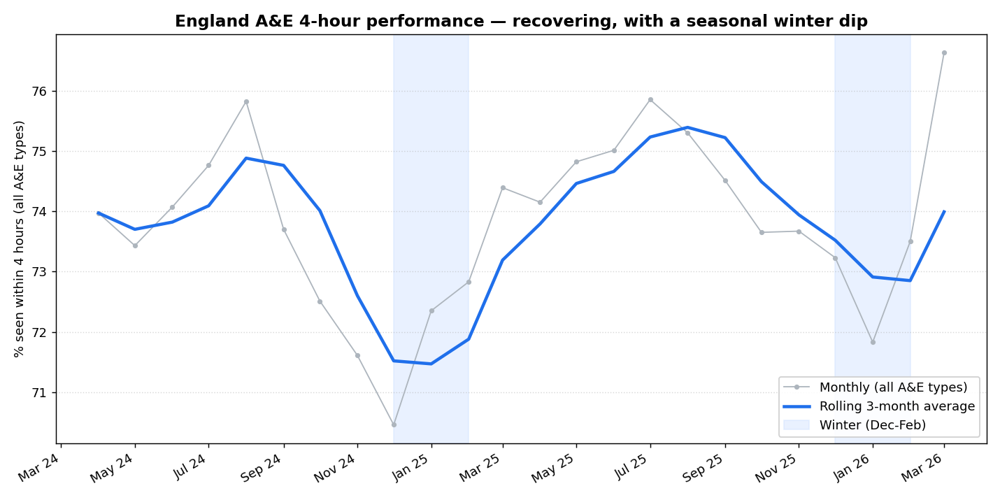
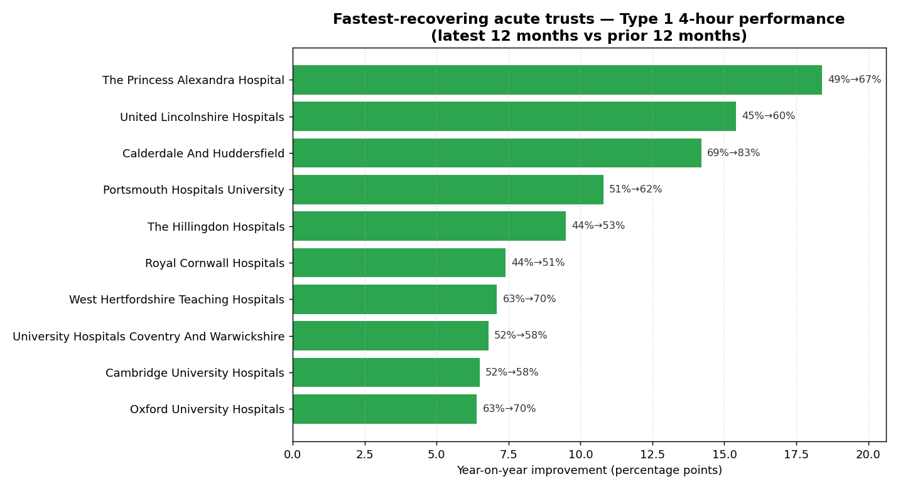
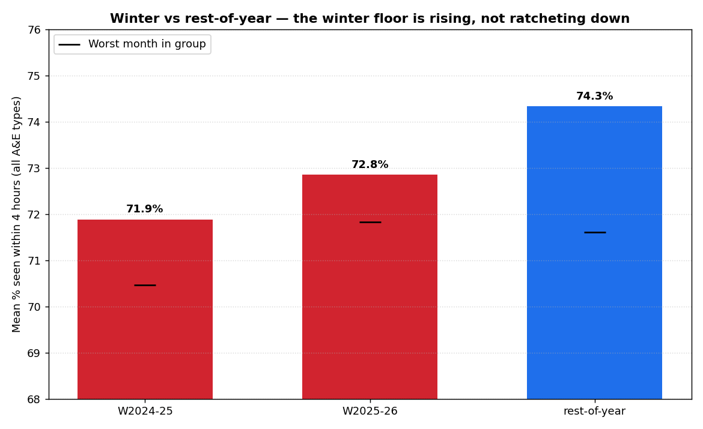

# NHS A&E 4-hour performance — a SQL-first recovery & seasonality analysis

> **Which acute NHS trusts are recovering fastest on the 4-hour A&E standard, and is winter pressure structural or seasonal?**

A DuckDB + SQL analysis of NHS England's monthly, provider-level A&E data,
**April 2024 – March 2026** (24 months, ~200 providers each). The analytical
work is done in SQL; Python is thin glue only (load the CSVs, run the SQL,
draw the charts). Framed for an NHS acute operations manager.

## TL;DR (full write-up in [`MEMO.md`](MEMO.md))

- **Recovering, modestly and broadly.** National all-types 4-hour performance
  rose **73.3% → 74.4%** (latest 12 months vs prior 12); March 2026 (**76.6%**)
  is the best month in the series.
- **Unevenly.** Of 113 acute Type 1 trusts, **77 improved, 36 declined** YoY.
  Fastest: **Princess Alexandra +18.4pp** (Type 1 49% → 67%). Worst:
  **Ashford & St Peter's −16.0pp**.
- **Winter is seasonal, and easing — not a structural ratchet.** The winter
  (Dec–Feb) average rose **71.9% → 72.8%** across the two winters, the floor
  lifted (worst month 70.5% → 71.8%), and each dip recovers the following
  spring.
- **Track Type 1.** The all-types headline (~74%) sits ~14 points above Type 1
  (~60%); the target bites in the major departments.

## Figures

**National 4-hour performance — monthly, rolling 3-month average, winter shaded**


**Fastest-recovering acute trusts (Type 1, latest 12 vs prior 12 months)**


**Winter vs rest-of-year — the winter floor is rising, not ratcheting down**


## Reproduce it

Requires Python 3.9+ with the pinned packages. No DuckDB CLI needed — SQL runs
through the DuckDB Python module.

```bash
pip install -r requirements.txt   # duckdb==1.4.5 pandas==2.3.3 matplotlib==3.9.4 pytest==8.4.2

bash data/raw/download.sh          # fetch the 24 monthly CSVs from NHS England
python3 load.py                    # build data/nhs.duckdb (schema -> ingest -> clean)
python3 run_analysis.py            # run the analysis SQL, render figures/*.png
pytest                             # 5 data-quality checks against the built DB
```

The raw CSVs and the built `.duckdb` are **git-ignored**;
`data/raw/download.sh` plus the SQL fully reproduce everything.

## How it's built

```
nhs-ae-sql/
├── data/raw/download.sh          # curl the 24 NHS England CSVs (URLs + retrieval date)
├── load.py                       # thin glue: schema -> ingest CSVs -> cleaning SQL
├── run_analysis.py               # thin glue: run analysis SQL -> matplotlib figures
├── sql/
│   ├── 01_schema.sql             # staging (all-VARCHAR) + typed clean tables
│   ├── 02_cleaning.sql           # parse Period->DATE, split TOTAL, cast, derive metrics
│   ├── 03_analysis_recovery.sql  # YoY recovery leaderboard (the star)
│   └── 03_analysis_seasonality.sql # national trace + winter-vs-rest
├── tests/test_load.py            # pytest data-quality suite
├── figures/                      # rendered PNGs (committed)
├── MEMO.md                       # one-page findings for an ops manager
├── requirements.txt              # pinned versions
└── README.md
```

**Data model.** Every raw CSV lands in one all-VARCHAR staging table tagged
with its filename month. `02_cleaning.sql` then types every measure
defensively (strips thousands separators, blanks → NULL via `TRY_CAST`),
parses the reporting month from the **filename** (the national TOTAL row does
not carry a reliable `Period` value), splits the single England `TOTAL` row
into a national table, and derives `perf = 1 − breaches/attendances` for both
all-types and Type 1. Natural key: `(period_month, org_code)`.

**SQL techniques on show.**
- `03_analysis_recovery.sql` — 5 layered CTEs; conditional aggregation with
  `FILTER` to pivot the two 12-month windows; volume-weighted window
  performance; `RANK()`, `DENSE_RANK()`, and `NTILE(4)` for the recovery
  leaderboard and quartile bands.
- `03_analysis_seasonality.sql` — rolling 3-month average via
  `AVG(...) OVER (... ROWS BETWEEN 2 PRECEDING AND CURRENT ROW)`; `LAG(...,12)`
  for year-on-year deltas; `LEAD(...)` for the next-month recovery check;
  `PERCENT_RANK()` to place each month in the distribution; and
  `PERCENTILE_CONT(0.5)` for the winter-vs-rest median.

## Honest limitations
- Many months are NHS England **revised** republications; figures are
  point-in-time and can change with later revisions. Each source file is
  pinned in `download.sh` for reproducibility.
- **Provider mix drifts** (198–202 sites/month) as trusts open/close/merge;
  the recovery ranking requires ≥60k Type 1 attendances in *both* years to
  reduce noise, but renamed/merged trusts can still distort single-trust
  trends.
- **All-types vs Type 1 are different questions** — don't mix them. Recovery is
  ranked on Type 1 (the target); the national seasonality view is all-types.
- Performance excludes zero-attendance provider-months and volume-weights the
  window aggregates by design (a large department counts more than a small one).

## Status
Local analysis project — **not published**, no live remote. All commits are
local. Data © NHS England, licensed under the Open Government Licence;
retrieved 2026-07-08 from the
[A&E waiting times and activity](https://www.england.nhs.uk/statistics/statistical-work-areas/ae-waiting-times-and-activity/)
statistical work area.


**Staging note:** the raw layer ingests every column NHS England publishes (including booked-appointment and emergency-admission counts) for fidelity; the clean layer deliberately consumes only the attendance and 4-hour-breach subset used by the analysis.
