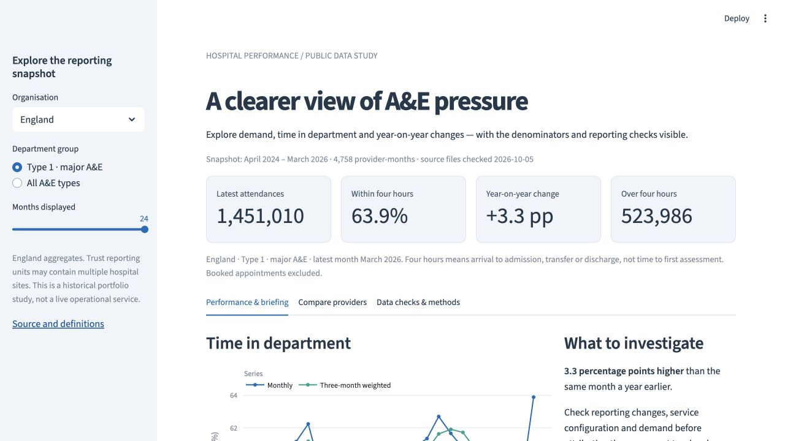
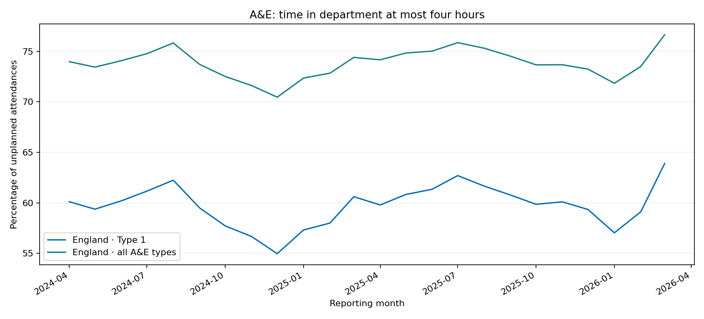

# Hospital performance explorer

[](https://github.com/abasukanga4/nhs-ae-sql/actions/workflows/checks.yml)

**An A&E reporting dashboard with SQL analysis, traceable source files and checks that stop invalid data entering the report.**

How has time in A&E changed across England, how do patterns vary between providers, and what should an operational analyst investigate next?

This independent portfolio study uses NHS England's **public, aggregate monthly data for April 2024–March 2026**: 24 source files and 4,758 provider-month records. It is a reproducible historical snapshot, not a live NHS service or an analysis of patient records.



**[Download native Tableau workbook](bi/Hospital%20Performance%20Explorer.twbx) · [Findings brief](MEMO.md) · [Metric definitions and validation](docs/METHODS.md) · [Tableau guide](docs/TABLEAU.md) · [Two-minute walkthrough](docs/WALKTHROUGH.md)**

## Explore it

Python **3.12** is used in CI. The checked-in, verified aggregate snapshot runs without an API key or a download step.

```bash
git clone https://github.com/abasukanga4/nhs-ae-sql.git
cd nhs-ae-sql
python3 -m venv .venv
source .venv/bin/activate
pip install -r requirements.txt
streamlit run app.py
```

Open the local URL shown by Streamlit. On Windows, activate with `.venv\Scripts\activate`.

- **Performance & briefing:** choose a provider, Type 1 or all A&E types, and 6/12/24 months; inspect monthly and volume-weighted trends; export the selected data and a briefing.
- **Compare providers:** compare two complete years of Type 1 reporting, with region and activity filters, visible denominators and a downloadable table.
- **Data checks & methods:** inspect the exact source URLs, hashes, validation rules and reconciliation results.

## A finding worth discussing

Across **England**, the proportion of Type 1 attendances completed within four hours was **60.56% in April 2025–March 2026**, versus **58.98% in the preceding year**: **+1.58 percentage points**. Type 1 attendance volume rose from **16.40 million to 16.74 million** across those windows.

The all-types annual measure was **74.37%**, showing why department definitions matter when interpreting a headline KPI. The dashboard lets a user explore any reporting provider and compare like-for-like periods.

These are descriptive observations, not proof that an intervention worked. The [findings brief](MEMO.md) explains the national context and questions an operational reporting team could investigate.



## What the implementation demonstrates

| Reporting task | Implementation |
|---|---|
| Make an extract repeatable | A manifest pins 24 official source URLs, reporting months and SHA-256 hashes. |
| Prevent silent data loss | Strict CSV schema, row-width, count, period and duplicate checks; unexpected values fail the build. |
| Reconcile published outputs | Six provider-level count measures reconcile with England totals in every month: **144 checks**. |
| Calculate defensible KPIs | SQL derives rates from summed counts, matches calendar months for year-on-year comparisons and handles zero denominators. |
| Produce useful comparisons | Complete-year and activity rules, latest organisation names, name-change flags and explicit interpretation limits. |
| Deliver a report | Streamlit dashboard, native Tableau workbook with an embedded Hyper extract, CSV exports and an operational brief. |
| Maintain the work | Automated tests, continuous integration and a previous database preserved when a new build fails. |

The web dashboard uses **Streamlit and Plotly**. A **native Tableau packaged workbook** is also included with three reporting sheets and the public extract. Its charts and provider, department and reporting-window controls were checked in Tableau Public 2026.2.3. The [Tableau guide](docs/TABLEAU.md#reconciliation-and-review) records the acceptance checks and reconciled totals.

## Rebuild from official sources

```bash
# Inside the activated environment:
python load.py --download     # download, validate, reconcile, then replace the database
python run_analysis.py        # export the checked dashboard snapshot, findings and chart
pip install -r requirements-dev.txt
ruff check .
ruff format --check .
pytest -q
```

`python load.py` reuses local source files. Raw CSVs and the built database are ignored by Git. Source files may be revised or removed by the publisher: a hash mismatch stops the build and requires an explicit review of the revision. It never silently changes the historical result.

The export step checks the database and manifest against the quality report. The dashboard verifies hashes of its committed input files before loading them. These hashes detect inconsistent files; they do not establish that the publisher's underlying returns are error-free.

## Project layout

```text
app.py                       Interactive reporting dashboard
nhs_ae/pipeline.py           Source validation and atomic database publication
nhs_ae/reporting.py          Shared SQL reporting functions
sql/                        Staging, typed tables and analytical queries
load.py                     Download/build command
run_analysis.py             Reproducible exports, chart and findings
data/source_manifest.json   Official source URLs and hashes
data/demo/                  Public aggregate snapshot used by the dashboard
reports/                    Quality report, findings and provider comparison
bi/                         Native Tableau workbook, packaged extract and review record
scripts/                    Rebuild the public Hyper extract and workbook
docs/                       Methods, Tableau guide and walkthrough
tests/                      Failure cases, metric behaviour and app smoke tests
```

## Interpretation and scope

Four hours means **arrival to admission, transfer or discharge**, not time to first assessment. Provider organisations can cover multiple hospital sites; attendances are visits, not unique people. Comparisons are descriptive and not adjusted for case mix. A stable organisation code does not rule out a reorganisation. Two winters are insufficient to infer a long-term structural trend or establish causality.

Source: [NHS England A&E Attendances and Emergency Admissions](https://www.england.nhs.uk/statistics/statistical-work-areas/ae-waiting-times-and-activity/), retrieved **5 October 2026**. Contains public sector information licensed under the [Open Government Licence v3.0](https://www.nationalarchives.gov.uk/doc/open-government-licence/version/3/). This project is independent of NHS England; no endorsement is implied.
